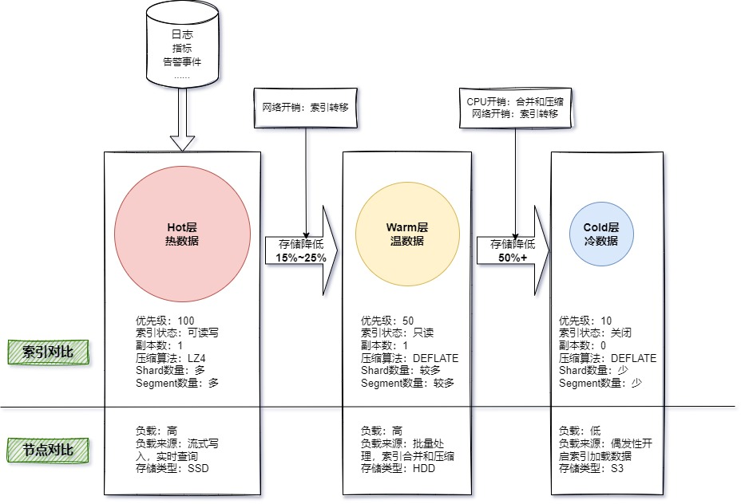
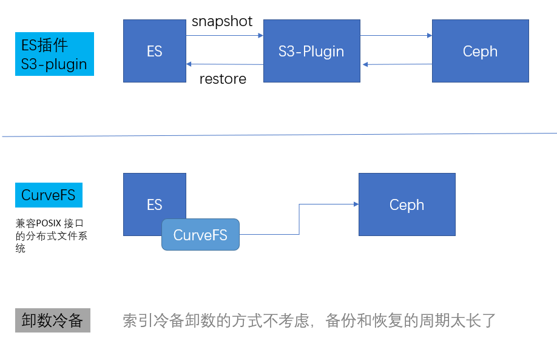
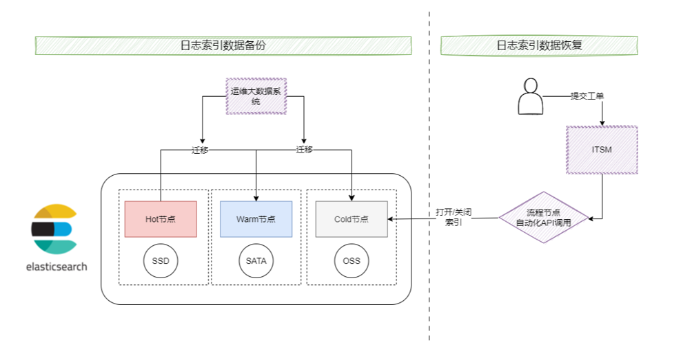
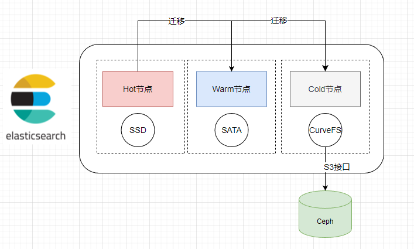
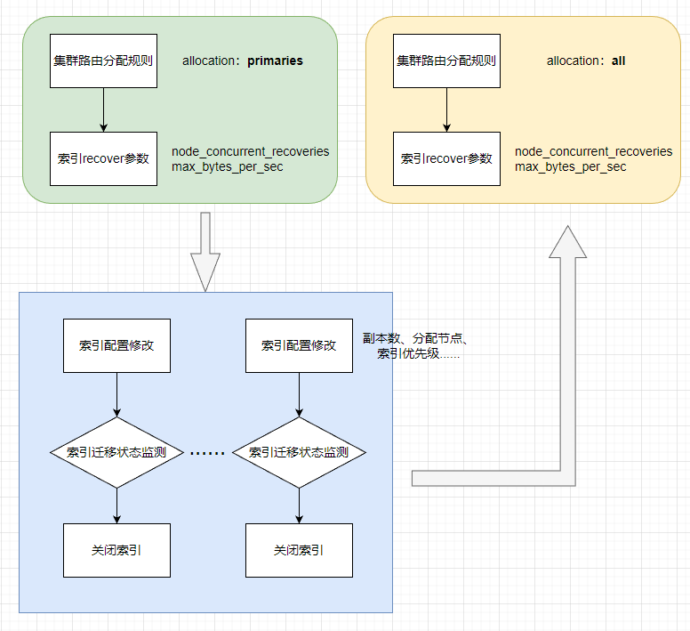
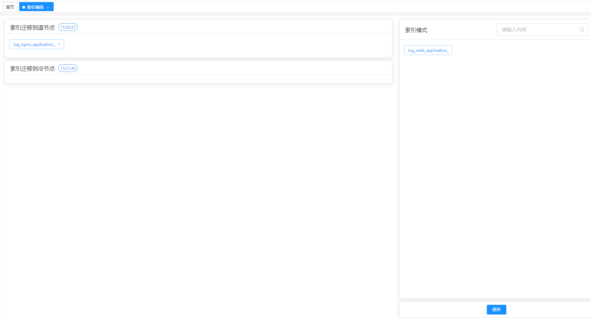
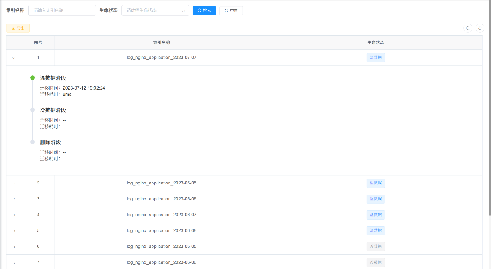

# 江苏农信选择CurveFS实现ES冷数据长期存储

## 一、需求背景
运维大数据平台自构建以来，日志类数据越来越多，目前已超过200TB；日志的种类也越来越丰富，除了最初的业务日志，还有存储ceph日志，中间件nginx、IHS、Tomcat等日志。目前大部分日志的保留周期都在14天或7天左右，无法满足业务日志和运维操作类日志长期保留的需求。各日志条线负责人，对日志的长期存储需求越来越急迫，一个是为了符合监管审计要求，二是对历史日志也能方便的检索分析。从平台角度来看，现有的方式缺乏统一的日志归档管理，各个业务线自我维护，重复建设消耗的成本高。

## 二、需求描述
### 场景一：业务侧日志
- **主要需求：** 监管审计，历史日志查看和检索
- **现阶段痛点：**
    - 现有的业务日志备份方式，是通过crontab脚本，定期打包put到对象存储 S3中
    - 该备份流程每个业务系统单独自我管理；
    - 同时在需要恢复的时候，需要人为手动操作，下载解压分析备份日志，整个流程耗时比较长。

### 场景二：运维侧日志
- **主要需求：** 监管审计，操作留档，历史回溯；例如网络设备相关日志，现要求保留半年以上。

## 三、日志数据分层管理方案设计
实现行内所有日志的统一备份管理，减少分散管理的压力和流程的混乱；同时运维大数据平台可以作为业务日志和对象存储中间的粘合剂，统一扎口，使之能更好的协同工作。 最后，基于数据分层处理，来大大减少索引存储大小以及内存的占用。
	

### 3.1 方案调研比对

**选择CurveFS优势：**
1. 索引备份操作变为索引迁移，对用户查询使用均无感知
2. 索引恢复速度快，直接打开索引即可被查询

### 3.2 整体方案设计
**实现方案：** 新增Cold层，实现日志长期留存。实现Cold层数据直接对接到对象存储，减少以前日志备份的中间过程，同时能加快对日志的恢复操作。

实现通过ITSM工单，自动恢复历史索引数据。

### 3.3 日志备份方案设计

1. ES分层设计
2. 冷节点层用于索引“备份”
3. 通过CurveFS实现数据无缝迁移到对象存储

### 3.4 日志恢复方案设计

### 3.5 日志备份功能实现

**备份执行流程：**

1. 修改集群参数，更好的满足迁移速度
2. 按照索引模式，循环迁移各个索引，并进行关闭
3. 修改集群参数，切换回低速迁移模式

**功能实现：**

1. 新建索引备份策略，基于索引模式角度
2. 新建备份迁移队列
3. 备份迁移队列编排
4. 队列定期执行

## 四、实际效果
### 4.1 日志备份功能
#### 4.1.1 迁移队列管理
配置队列每日执行的时间点，关联的接口，以及是否启用；还可以查看历史执行记录：

#### 4.1.2 索引生命周期策略管理

统一的生命周期策略管理，一目了然：

配置每个队列中，索引的迁移的顺序；队列之间是并行执行，队列中是串行执行。

另外，部分索引不需要长期存储，只需要通过配置迁移到温节点队列即可。

灵活查看索引的整个生命周期阶段：

### 4.2 日志恢复功能
#### 4.2.1 用户工单流程配置

#### 4.2.2 用户申请工单表单

## 五、方案总结
- **统一管理：** 对ES进行上层封装建设，减少对Kibana的依赖，对多集群、多版本ES可以进行统一管理；
- **自主可控：** 通过自研开发，更贴合实际场景；部分日志需要长期留存，转移到冷节点；部分不需要长期留存，在转移到温节点后，静待删除；
- **更细粒度的控制：** 队列配置了索引迁移开始时间，队列中的索引基于编排的顺序，串行开始迁移；
- **并行控制：** 基于队列的机制，实现备份迁移的并行。如果后端存储性能足够，可以多开几个队列，充分利用凌晨的空闲IO；
- **统一的策略管理：** 所有索引备份策略一目了然，方便全局掌控，快速调整；
- **全生命周期管理：** 索引从产生到最后删除，每一个阶段都留有记录，通过时间树的方式快速查看。

### 带来的价值：
- **灵活性，高效性：** 都是从S3取数据，这个直接通过打开索引，就能恢复提供查询；
- **流程数字化，自动化：** 通过工单申请，能自动进行接口调用，实现索引恢复和定期关闭；
- **优化日志数据存储分层，实现降本增效：** 对本地SATA盘的依赖减少，依靠云存储的稳定性，ES本地节点存储容量为0，全部存储到S3；

