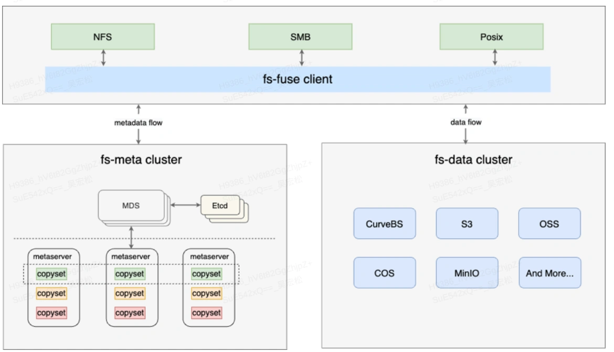
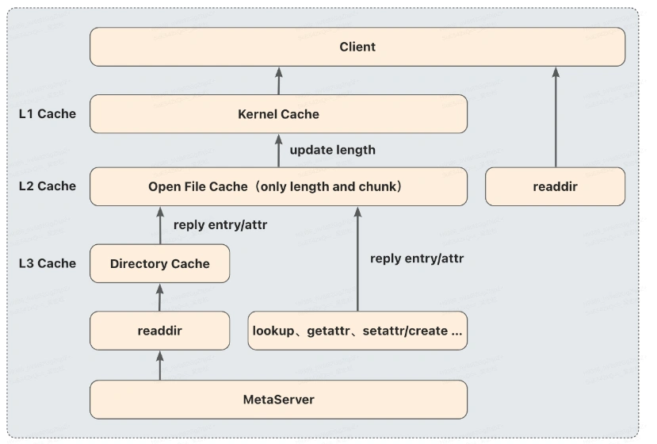
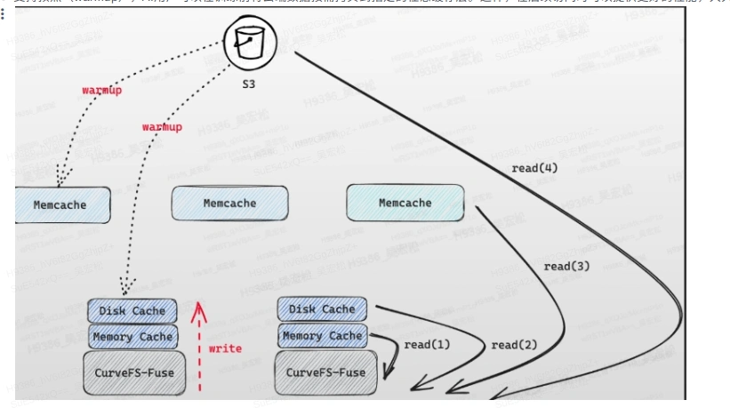

# CurveFS在AI训练场景下的降本提效实践

## 一、项目背景

在当今大数据和人工智能领域的快速发展中，随着数据量的爆炸式增长，对分布式文件系统的存储可扩展性、成本和性能提出了更高的要求。在此大势所趋之下，杭研云计算团队开发了Curve共享文件存储系统来解决这些问题。

Curve共享文件存储系统旨在解决以下问题：

### 可扩展性问题

随着文件数量的增长，现有的文件系统如CephFS和HDFS等元数据的可扩展性不足，无法满足大规模文件存储的需求。Curve文件系统将提供可扩展的共享文件存储，解决元数据管理的问题。

### 性能问题

随着文件数量的增加，文件元数据的性能会大幅下降。此外，小文件的读写性能也比较差，这会对大数据和AI等业务产生影响。Curve文件系统将优化元数据管理，提高文件检索效率，并改善小文件的读写性能。

### 成本问题

现有的文件系统通常采用两副本或三副本技术，但实际上80%的数据都是冷数据，使用多副本技术存储成本较高。Curve文件系统将采用更高效的数据存储策略，降低存储成本，提高资源利用率。

通过解决这些问题，Curve文件系统不仅将为公司的核心业务提供稳定、高效的存储支持，同时也会对开源社区做出重要贡献。我们致力于将Curve文件系统打造成为一款广泛使用的开源存储软件，为全球的开发者社区提供可扩展、高性能和低成本的存储解决方案。我们相信，Curve文件系统的研发和应用将促进技术创新，推动整个开源社区的发展。

## 二、项目思路和方案

### 文件系统的元数据独立存存储

解决元数据增长带来的扩展性和性能要求。通过创新的设计和实现，使得其中元数据被存储在一个独立的集群中。随着文件数量的不断增加，元数据集群可以持续扩展，确保了元数据的线性扩展能力。这种设计有效地解决了传统文件系统在处理大规模文件时面临的性能和可扩展性挑战。

Curve共享文件存储系统通过对元数据进行合理的分片，使得多个分片可以分布在由多台服务器组成的元数据集群中。当前方案按照inodeid进行分片，按照算法serverid = (inodeid / inode_per_segment) mod metaserver_num进行分片。

例如，如果按照每个分片管理100个inodeid，有3个metaserver，那么分片信息将如下。如果元数据数量增加，可以通过增加元数据集群的服务器来实现线性扩展的目标。

### 文件系统数据存储的降本增效

文件数据最终存储在S3上，例如集团内部的NOS、阿里云OSS、AWS S3等。S3通常使用EC技术（一般可以支持1.2副本），相比2副本或3副本，在保证可靠性的同时可以大幅度降低存储成本。

以网易对象存储这边当前主流的EC 20+4使用为例，该使用方式相当于1.2副本。因此，以需要1PB使用空间为例，使用Curve共享文件存储系统+1.2副本对象存储只需要1.2PB空间，相比本地盘2副本可以节省约800TB的容量，成本优化效果非常显著。

### 文件系统数据和元数据都支持多级缓存

在工程实践中，由于S3和元数据集群都需要通过网络进行访问，每次读写操作都会经过网络，这可能会对业务性能产生负面影响。为了解决这个问题，Curve共享文件存储系统在保证多挂载点一致性的情况下，进行了数据和元数据的性能优化，主要思路是增加缓存。

#### 数据缓存
数据支持多级缓存，主要包括：
- 内存缓存：用于加速当前节点上的读写速度。
- 本地缓存：同样用于加速当前节点上的读写速度。
- 全局缓存集群：用于加速当前节点以及多节点数据共享时的速度。

#### 元数据缓存

元数据缓存支持metaserver端内存缓存、kernel缓存和本地客户端缓存。

缓存何时加载或失效是元数据缓存的难点。与采用分布式锁的做法相比，Curve共享文件存储系统选择不实现复杂的分布式锁机制，而是基于业务分析不需要完全强一致性的前提，为每种类型的缓存数据制定了一些规则，在满足业务一致性的前提下提供了较好的性能。

此外，通过结合VFS层的重试机制，Curve共享文件存储系统提供了完善的CTO（close-to-open）一致性，完全满足CTO语义。相对于JuiceFS等依赖用户缓存时长配置来实现CTO的存储系统，Curve共享文件存储系统具有更好的性能，并在任何场景下都能保证CTO一致性。

 

### 文件系统支持数据预读和预热

#### 支持预读（Prefetch）

即在数据访问时，可以将文件超过访问长度外的数据提前读入缓存。

#### 支持预热（warmup）

AI用户可以在训练前将云端数据按需拷贝到指定的任意缓存层。这样，在后续访问时可以提供更好的性能，大大节省训练时间。

## 三、项目影响力和产出价值

### 为业务降本提效

杭研多媒体团队 AI 业务使用三副本 Ceph 内核文件存储来支撑AI场景，包括通用、AI相关的各种流程。AI 业务存储的数据量是巨大的，但其中 80% 都是冷数据，使用三副本存储成本很高。业务期望找一个文件系统替换 Ceph，在保证性能的同时能够降低存储成本。

同样 Curve共享文件存储系统可以无缝接入业务，目前杭研多媒体 AI 业务已全量迁入 Curve共享文件存储系统，业务使用后的收益包括：

- 成本下降：Curve共享文件存储系统 后端接入 NOS低频存储，相比3副本存储每年每 PB 数据存储可节约40%成本
- 性能收益：在通用场景 Curve共享文件存储系统性能和 Ceph 内核文件系统差不多持平，在 AI 存储密集型的特征提取和部分特征训练场景性能提升30%+，计算密集型特征训练场景性能和Ceph内核文件系统持平。尤其是在昂贵的GPU节点上，存储性能提升可以带来更高的GPU利用效率，从而降低训练成本。
- 提升训练任务并发度：使用Ceph文件系统作为AI训练数据集存储后端时，所有数据需要实时从存储后端读取，一旦业务有多个AI任务需要并发执行，就会导致Ceph文件系统存储后端负载超出集群总能力，最终导致训练任务耗时大大拉长。Curve共享文件存储系统通过利用多级缓存加速能力，大部分训练数据只需要从存储后端读取一次即可缓存到本地或分布式缓存集群，从而降低对存储后端的性能需求，把负载分散到训练节点或分布式缓存集群，极大提升训练任务的并发度，减少多个训练任务之间的互相影响。

另外云音乐广告算法团队AI业务也已经落地使用Curve共享文件存储系统，稳定运行半年多。

Curve共享文件存储系统不仅适用于AI业务场景，还适用于ElasticSearch等大数据存储分析业务场景，目前也在多个集团内部业务场景落地使用。

## 四、项目未来规划和展望

Curve 是一个开源项目（包括共享文件存储和块存储两个子项目），不仅服务于网易内部，也服务于外部用户，当前外部仍然存在大量的 AI 业务场景下的存储需求，目前 Curve共享文件存储系统在 AI 场景下的落地，已证明其在该场景下的性价比优势，更有利于后续在该场景下的推广。

Curve 作为一个年轻的文件系统，仍在快速迭代发展中，后续将继续聚焦在 AI 、大数据存储等场景：
- 和 AI 框架的融合：做到⾃动预热、训练节点和缓存节点的亲和性调度、与各类算法平台的深度融合等，进一步提升AI训练场景下的易用性和性能表现
- ⼤数据和 AI 的融合：提供 HDFS 接⼝，使⽤ Curve共享文件存储系统即可以⽤在数据⽣产收集也可以⽤于后续处理和训练
- 推动在更多业务场景的落地

